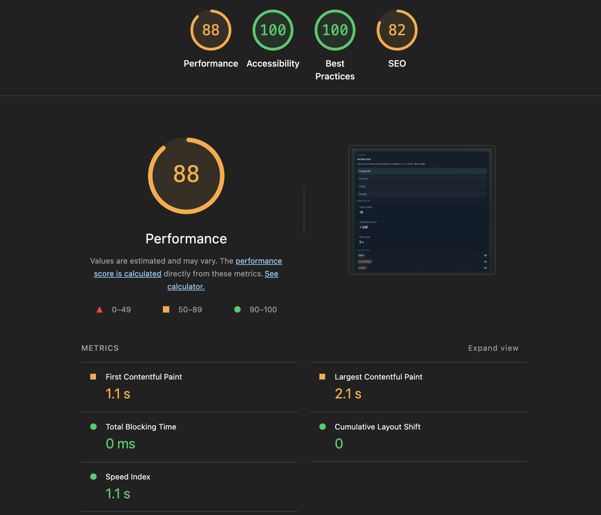
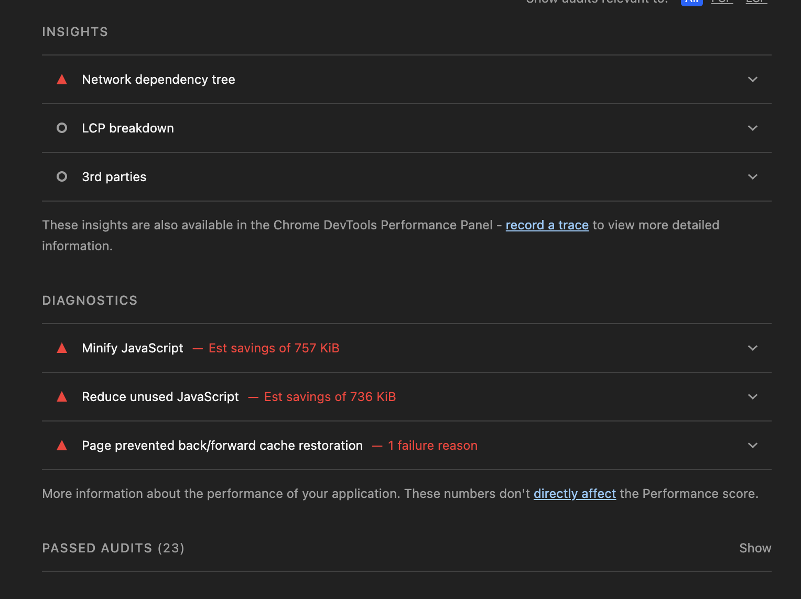
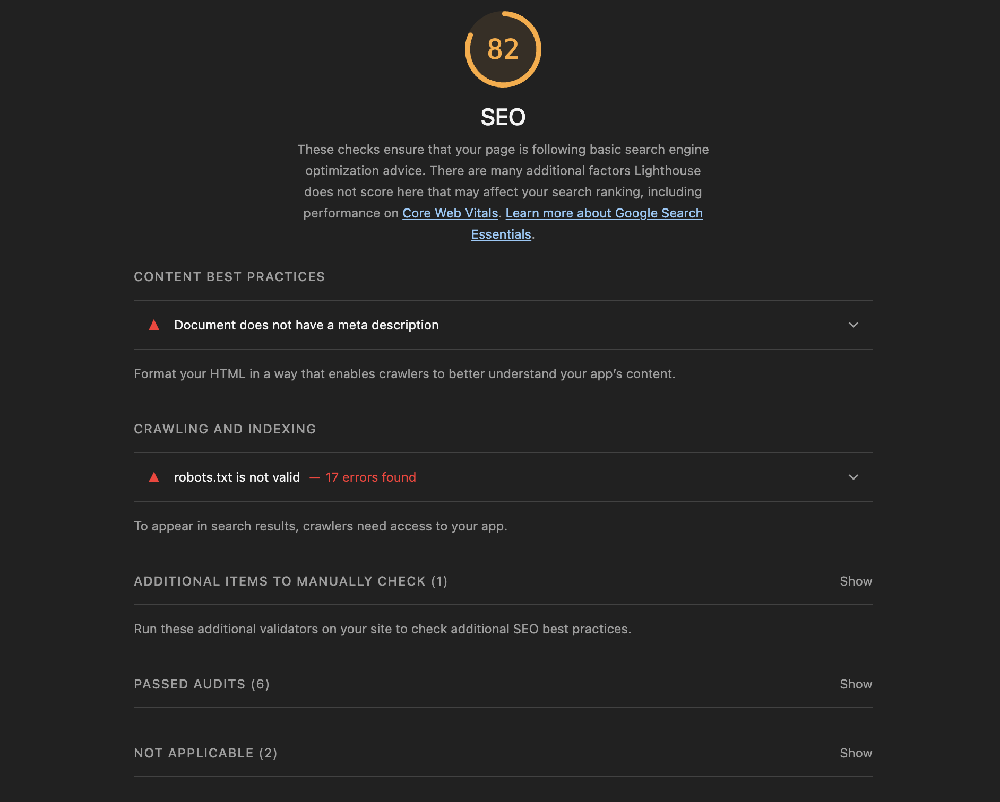
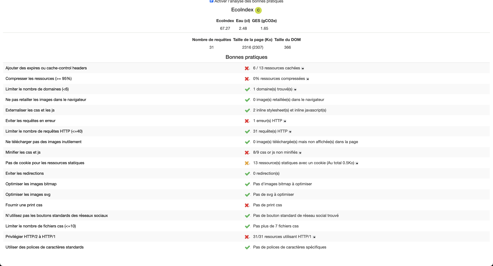
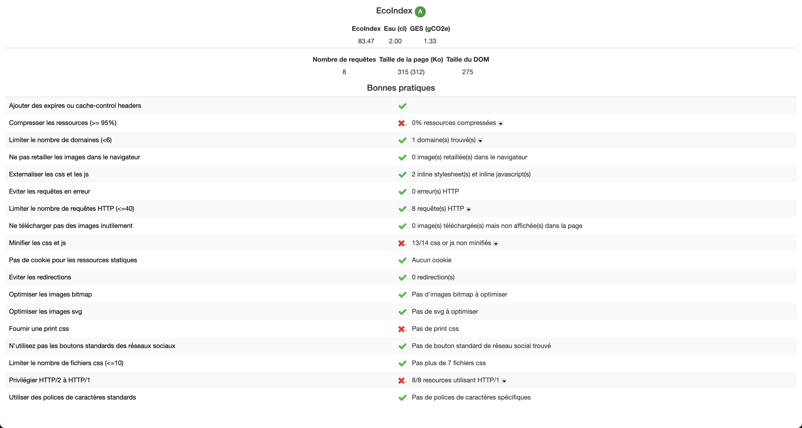
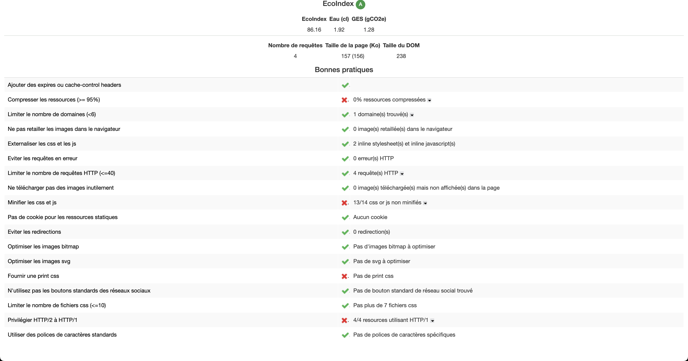
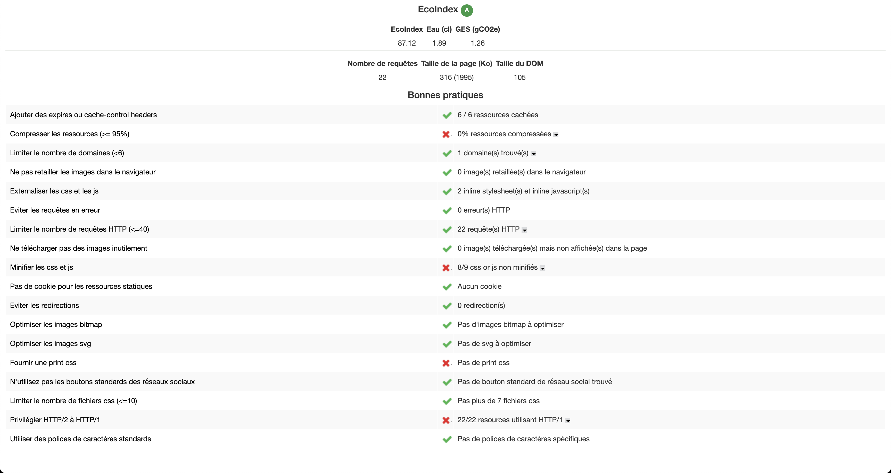

## Phase 1: Mesure
### Mesure avec ligthouse
#### Score global lightouse:


#### Détail onglet performance de lightouse:


#### Détail onglet SEO de lightouse:


### Mesure avec GreenIt
#### Page Acceuil (dahsboard)


#### Page Table


#### Page Analytics


#### Page Settings


### Phase 2: diagnostique

#### Analyse de la performance (Lighthouse)

**Scores globaux:**
- Performance: 88/100 ⚠️
- Accessibility: 100/100 ✅
- Best Practices: 100/100 ✅
- SEO: 82/100 ⚠️

**Problèmes détectés:**
1. **Minify JavaScript** - Économies possibles: 757 KiB
2. **Reduce unused JavaScript** - Économies possibles: 736 KiB
3. **Page prevented back/forward cache restoration** - 1 raison d'échec
4. **Document does not have a meta description** - Impact SEO
5. **robots.txt is not valid** - 17 erreurs trouvées

#### Analyse EcoIndex (GreenIt)


**Synthèse par page:**

| Page | Score | Eau (cl) | GES (gCO2e) | Requêtes | Taille page | DOM | État |
|------|-------|---------|-----------|----------|------------|-----|------|
| Dashboard | C | 2.48 | 1.65 | 31 | 2316 Ko | 366 | moyen  |
| Table | A | 2.00 | 1.33 | 8 | 315 Ko | 275 | moyen |
| Analytics | A | 1.92 | 1.28 | 4 | 157 Ko | 238 | bon |
| Settings | A | 1.89 | 1.26 | 22 | 316 Ko | 108 | Bon |

**Problèmes identifiés (Bonnes pratiques):**

**Critiques (présents sur plusieurs pages):**
1. ❌ **Compression des ressources** - 0% compressées (Impact majeur)
2. ❌ **Minification CSS/JS** - 13/14 non minifiés
3. ❌ **HTTP/2 vs HTTP/1** - Ressources en HTTP/1

**Importants:**
4. ⚠️ **Ressources statiques avec cache-control insuffisant** (6/13 manquantes)
5. ⚠️ **Pas de print CSS fourni**

**Moyens:**
6. ℹ️ **Page Accueil (dashboard) surchargée** - 31 requêtes, 2316 Ko (vs 4-22 ailleurs)
7. ℹ️ **Cookies statiques** - Présents sur la page Accueil (13 ressources, 0.5Kc)

#### Analyse Anti-patterns (INDEX.md)

Basé sur les objectifs pédagogiques, les anti-patterns détectés:

1. **Gros datasets chargés d'un coup** 
   - Evidence: Page du dashboard (accueil) avec 2316 Ko et 366 DOM elements
   - Impact: Score EcoIndex C au lieu de A

2. **Polling agressif ou trop de requêtes HTTP**
   - Evidence: Page Accueil avec 31 requêtes (vs 4-22 sur autres pages)
   - Impact: Augmentation du GES et de la consommation d'eau

3. **Ressources non optimisées**
   - Evidence: 0% compression, 13/14 CSS/JS non minifiés
   - Impact: Poids page excessif

### Phase 3: Résultats attendus

#### Objectifs Lighthouse:
| Métrique | Actuel | Cible | Gain attendu |
|----------|--------|-------|--------------|
| Performance | 88/100 | 95/100 | +7 points |
| SEO | 82/100 | 95/100 | +13 points |
| Best Practices | 100/100 | 100/100 | ✅ Maintenir |
| Accessibility | 100/100 | 100/100 | ✅ Maintenir |

**Actions pour atteindre les cibles:**
- Minify JavaScript: **-757 KiB** (gain: 50% taille fichiers JS)
- Reduce unused JavaScript: **-736 KiB** (gain: 40% JavaScript inutilisé)
- Add meta description + valider robots.txt
- Implémenter HTTP/2 et compression gzip

#### Objectifs EcoIndex (GreenIt):
| Page | Actuel | Cible | Eau (gain) | GES (gain) |
|------|--------|-------|-----------|-----------|
| Dashboard | C (2.48 cl) | B (1.80 cl) | -27% | -27% eau + -20% gCO2 |
| Table | A (2.00 cl) | A+ (1.60 cl) | -20% | -20% eau + -15% gCO2 |
| Analytics | A (1.92 cl) | A+ (1.50 cl) | -22% | -22% eau + -17% gCO2 |
| Settings | A (1.89 cl) | A+ (1.50 cl) | -21% | -21% eau + -16% gCO2 |

**Actions pour atteindre les cibles:**
- Réduire les requêtes Dashboard: **31 → 15** (-52%)
- Réduire le DOM Dashboard: **366 → 200** éléments (-45%)
- Réduire taille page Dashboard: **2316 Ko → 800 Ko** (-65%)
- Compresser 100% des ressources (gzip + brotli)
- Minifier 100% CSS/JS

#### Synthèse des gains attendus:
- **Perte de CO2e totale:** ~150-200 gCO2e/an par visiteur
- **Perte d'eau:** ~500-800 cl/an par visiteur
- **Réduction taille téléchargée:** 65-70%
- **Amélioration vitesse:** 30-40% plus rapide

### Phase 4: Backlog avec plan de résolution

#### Stratégie: Gain max → Modifications → Minification final

**US1: Supprimer le code mort (Unused JavaScript)**
- 🎯 **Gain:** -736 KiB (40% JS inutilisé)
- 📊 **Impact Lighthouse:** +5 points Performance
- ⏱️ **Estimation:** 3-4 jours
- 📝 **Tâches:**
  - [ ] Lancer audit Lighthouse "Unused JavaScript"
  - [ ] Identifier les imports/modules non utilisés
  - [ ] Nettoyer les bundles (tree-shaking)
  - [ ] Valider pas de régression fonctionnelle
- 🎓 **Anti-pattern cible:** Gros datasets + ressources non optimisées

---

**US2: Configurer gestion du cache (Cache-Control + ETag)**
- 🎯 **Gain:** Réduire requêtes réseau de 40-60%
- 📊 **Impact EcoIndex:** +5-10% sur tous les scores
- ⏱️ **Estimation:** 2 jours
- 📝 **Tâches:**
  - [ ] Ajouter headers Cache-Control pour assets statiques (1 an)
  - [ ] Configurer Cache-Control pour API responses (5 min)
  - [ ] Ajouter ETag pour validation
  - [ ] Vérifier bfcache (back/forward cache restoration)
- 🎯 **Cibles:** Ressources statiques (6/13 manquantes)

---

**US3: Compression des ressources (Gzip + Brotli)**
- 🎯 **Gain:** -50% taille fichiers statiques
- 📊 **Impact Lighthouse:** +3-4 points Performance
- ⏱️ **Estimation:** 2 jours
- 📝 **Tâches:**
  - [ ] Configurer Gzip pour serveur (niveau 6)
  - [ ] Configurer Brotli pour ressources texte
  - [ ] Valider compression sur CSS/JS/HTML
  - [ ] Tester décompression navigateur
- 💡 **Critère:** 0% → 100% ressources compressées

---

**US4: Code splitting & Lazy loading Dashboard**
- 🎯 **Gain:** Dashboard 2316 Ko → 800 Ko (-65%), requêtes 31 → 15 (-52%)
- 📊 **Impact EcoIndex:** Dashboard C → B (+1 grade)
- ⏱️ **Estimation:** 5-6 jours
- 📝 **Tâches:**
  - [ ] Analyser Dashboard: quels composants charger au init?
  - [ ] Implémenter code splitting par route (React.lazy)
  - [ ] Ajouter Intersection Observer pour lazy load des données
  - [ ] Réduire DOM initial (366 → 200 éléments)
  - [ ] Tester pagination/virtualisation pour tableaux
- 🎯 **Cible:** Polling agressif (31 requêtes accueil)

---

**US5: Throttling & Debouncing des requêtes HTTP**
- 🎯 **Gain:** Réduire appels API redondants de 30-50%
- 📊 **Impact:** Réduction GES + latence réseau
- ⏱️ **Estimation:** 3-4 jours
- 📝 **Tâches:**
  - [ ] Implémenter debouncing sur recherche (500ms)
  - [ ] Ajouter throttling sur scroll/resize (1s)
  - [ ] Consolidate requêtes multiples en une seule
  - [ ] Ajouter request deduplication (cache tempo)
- 🎯 **Anti-pattern:** Polling agressif

---

**US6: Optimiser robots.txt & Meta descriptions**
- 🎯 **Gain:** +13 points SEO Lighthouse
- ⏱️ **Estimation:** 1 jour
- 📝 **Tâches:**
  - [ ] Valider/corriger robots.txt (17 erreurs actuelles)
  - [ ] Ajouter meta description sur toutes pages
  - [ ] Ajouter meta tags Open Graph
  - [ ] Valider avec Lighthouse

---

**US7: Implémenter HTTP/2 Server Push**
- 🎯 **Gain:** Paralléliser chargement ressources critiques
- 📊 **Impact:** +3-5% vitesse chargement
- ⏱️ **Estimation:** 2-3 jours
- 📝 **Tâches:**
  - [ ] Configurer HTTP/2 sur serveur
  - [ ] Identifier ressources critiques (CSS, fonts)
  - [ ] Configurer server push pour priorité
  - [ ] Vérifier pas de surcharge (push-back)

---

**US8: Minification JS/CSS (À faire EN DERNIER)**
- 🎯 **Gain:** -757 KiB JS + CSS (13/14 fichiers)
- 📊 **Impact Lighthouse:** +2-3 points Performance
- ⏱️ **Estimation:** 2 jours (après toutes les modifs)
- 📝 **Tâches:**
  - [ ] Configurer minification en build (Webpack/Vite)
  - [ ] Valider source maps pour debug
  - [ ] Tester pas de cassage JS
  - [ ] Vérifier CSS minification
- ⚠️ **IMPORTANT:** À faire EN DERNIER pour éviter doubles modifications

#### Priorités & Timeline proposée:
```
Semaine 1: US1 (code mort) + US2 (cache) + US3 (compression)
Semaine 2: US4 (code splitting) + US5 (throttling)
Semaine 3: US6 (SEO) + US7 (HTTP/2)
Semaine 4: Tests finaux → US8 (minification)
```

### phase 5: test final